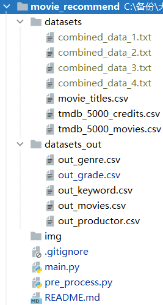

# 电影推荐系统Demo

根据视频教程：[基于知识图谱电影推荐问答系统实战_哔哩哔哩_bilibili](https://www.bilibili.com/video/BV1aU4y1g7hw)

手撸了一个，简单的Demo，学习一下 Python 和 Neo4j 的简单使用。

## 环境

- python3.7
- neo4j-3.5.6
- PyChram 2021

## 数据集

- [Netflix Prize data -- combined_data_1.txt | Kaggle](https://www.kaggle.com/netflix-inc/netflix-prize-data?select=combined_data_1.txt)
- [TMDB 5000 Movie Dataset | Kaggle](https://www.kaggle.com/tmdb/tmdb-movie-metadata)

## 文件结构

如下图所示：

说明：

- datasets：存放数据集的文件夹(其中 Netflix数据集 过大没有上传)
- datasets_out：存放数据预处理结果的文件夹，也就是运行 `pre_process.py` 后输出的结果文件
- main.py：推荐模块
- pre_process.py：数据预处理模块

## 运行过程

0. 目前预处理的数据已经放入 `datasets_out` 文件夹中，想要自己再重新跑一遍就先运行一下 `pre_process.py` 。
1. 将 `datasets_out` 文件夹中的文件复制到 neo4j 安装目录下的 import 文件夹内
2. 修改 `main.py` 中 neo4j 数据库的用户名密码改为你自己的
3. 运行 `main.py` ，会提示“是否需要重新加载知识图谱? 输入0或1: ” 如果是第一次运行，输入1，会将neo4j中的数据清空，如有别的数据请先备份。
4. 此时会开始将数据集载入 neo4j 中，可能过程较慢
5. 之后按照提示输入即可，例如用户ID为944的就会有数据。

